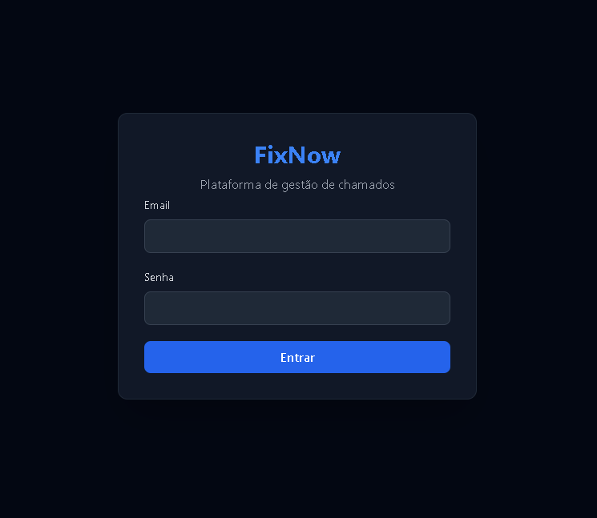
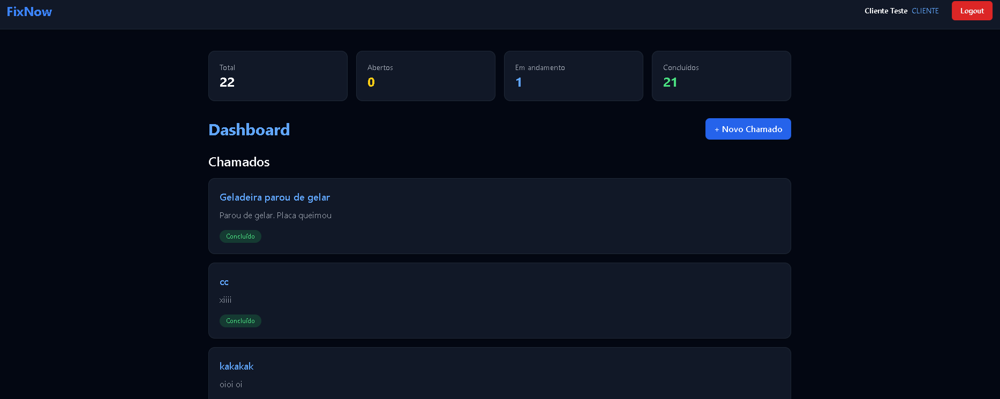
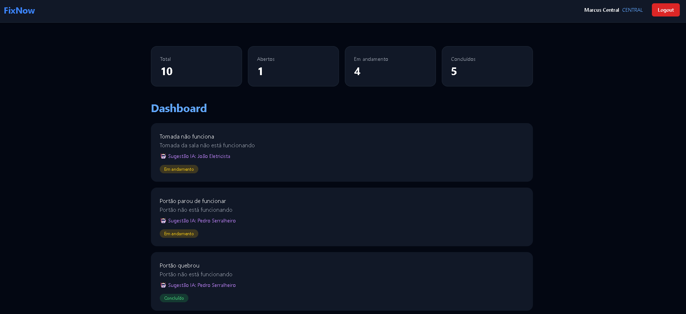
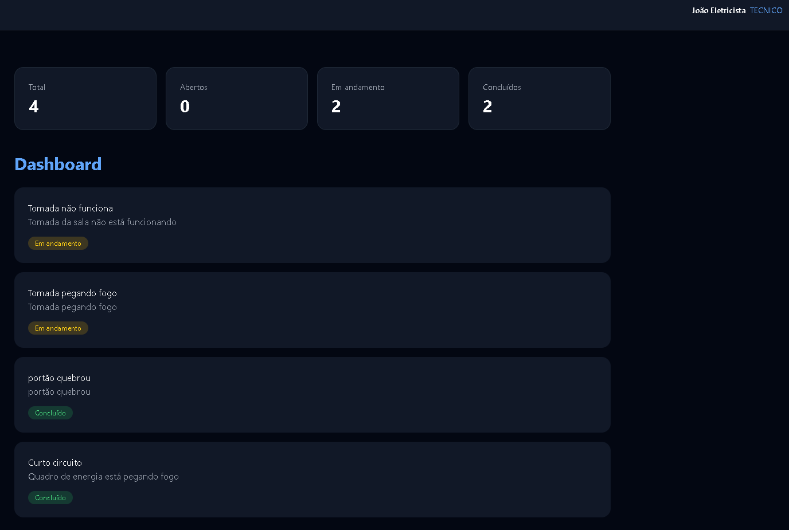
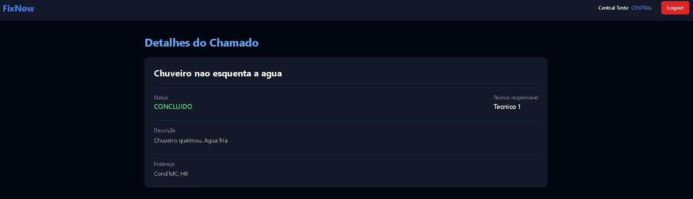

# FixNow
Plataforma fullstack para gestão de chamados técnicos, com autenticação JWT e controle de acesso por perfil.

---

## Visão Geral
O FixNow é um sistema de gerenciamento de chamados técnicos desenvolvido com arquitetura moderna, separação de responsabilidades e foco em segurança.

O sistema permite:

    -Clientes abrirem chamados
    -Central administrativa atribuir técnicos
    -Técnicos finalizarem atendimentos
    -Controle de acesso por perfil (CLIENTE, TECNICO, CENTRAL)
    -Autenticação via JWT
    -Proteção de rotas no frontend

---

## Arquitetura
```
fixnow/
│
├── backend/ # API REST (FastAPI + SQLModel + PostgreSQL)
├── frontend/ # Interface (React + TypeScript + Vite)
└── README.md
```

## Backend
- FastAPI  
- SQLModel  
- PostgreSQL  
- JWT Authentication  
- OAuth2 Password Flow  

Arquitetura em camadas:
- `routers` → definição dos endpoints
- `services` → regras de negócio
- `models` → entidades do banco
- `schemas` → validação e serialização
- `core` → segurança e configurações

---

## Frontend
- React
- TypeScript  
- Vite  
- TailwindCSS  
- Consumo de API via token JWT 
- Renderização dinâmica baseada no perfil do usuário 

---

## Controle de Acesso
O sistema possui três níveis de acesso:

**CLIENTE**  
→ Pode abrir e visualizar seus próprios chamados  

**TECNICO**  
→ Visualiza apenas chamados atribuídos a ele  
→ Pode finalizar chamados em andamento  

**CENTRAL**  
→ Pode visualizar todos os chamados  
→ Pode atribuir técnicos  

---

## Fluxo Operacional
1. Cliente cria chamado → `ABERTO`
2. Central atribui técnico → `EM_ANDAMENTO`
3. Técnico finaliza atendimento → `CONCLUIDO`

Transições de status são controladas na camada de serviço do backend.

---

## Screenshots

### Login

### Dashboard Cliente


### Dashboard Central


### Dashboard Técnico


### Detalhe do Chamado

---

## Como rodar o projeto
### Backend
```
cd backend
python -m venv venv
venv\Scripts\activate
pip install -r requirements.txt
uvicorn app.main:app --reload
```

### Frontend
```
cd frontend
npm install
npm run dev
```
---

### Objetivo do Projeto
Este projeto foi desenvolvido como:
- Demonstração de arquitetura backend profissional
- Exercício de autenticação e autorização com JWT
- Base estruturada para futura evolução como SaaS

### Autor
Marcus Brandão //Backend Dev (Python|APIs REST|Arquitetura)
