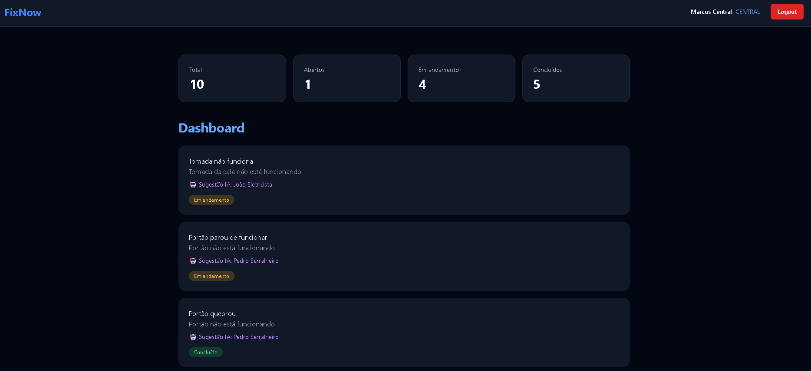
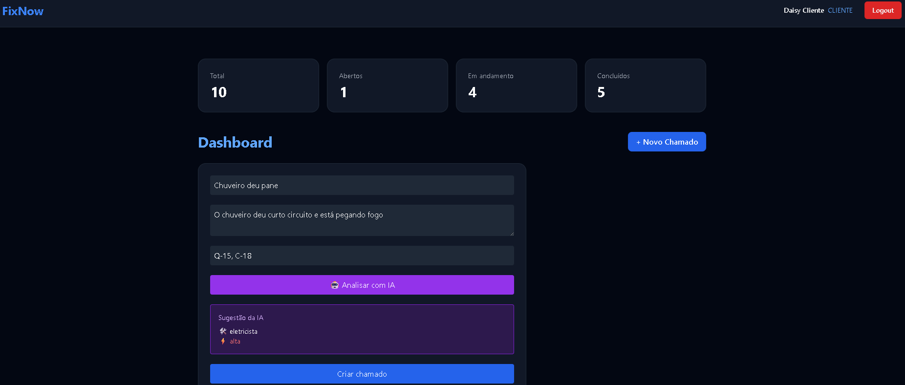
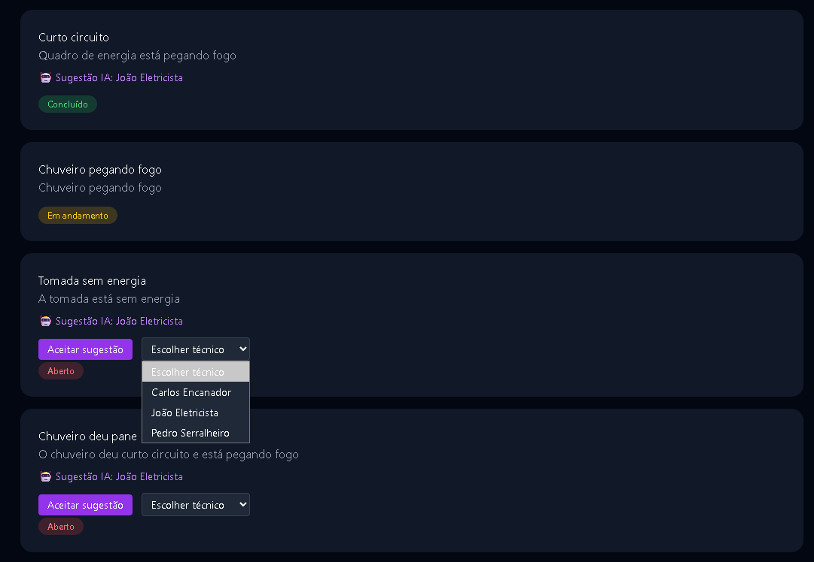
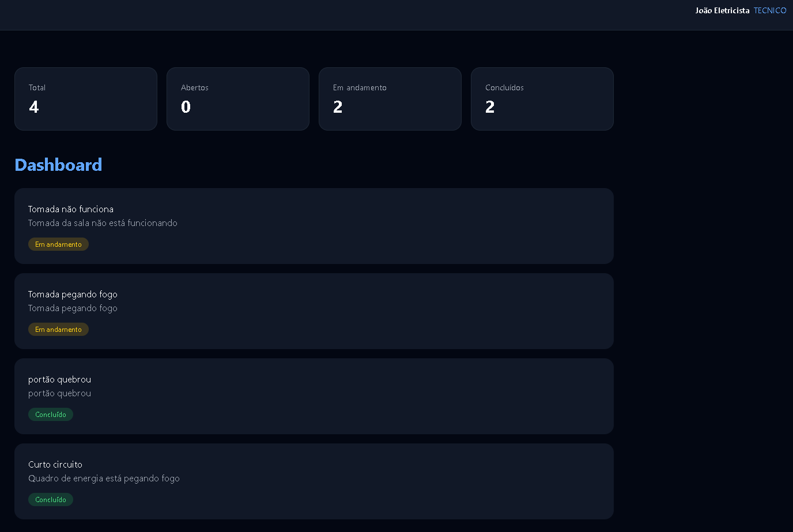
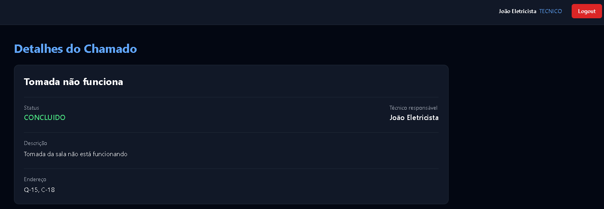

# FixNow — Sistema de Gestão de Chamados com IA
O FixNow é um sistema full stack para gestão de chamados técnicos, com priorização inteligente e sugestão automática de profissionais.

---

## Objetivo
Simular um sistema real utilizado por empresas para:

- abertura de chamados por clientes
- análise automática com IA
- sugestão de técnico adequado
- decisão da central
- acompanhamento do fluxo do atendimento

---

## ⚙️ Tecnologias
### Backend
- FastAPI
- SQLModel
- PostgreSQL

### Frontend
- React
- TypeScript
- TailwindCSS

---

## Funcionalidades principais
### Cliente
- Criação de chamados
- Análise com IA (categoria + urgência)
- Interface simples e direta

### Inteligência Artificial
- Classificação do problema
- Definição de urgência
- Sugestão de tipo de profissional

### Central
- Visualização de todos os chamados
- Sugestão automática de técnico
- Possibilidade de:
  - aceitar sugestão da IA
  - escolher técnico manualmente

### Técnico
- Visualização de chamados atribuídos
- Atualização de status

---

## Fluxo do sistema

1. Cliente abre chamado
2. IA analisa descrição
3. Sistema sugere técnico
4. Central decide:
   - aceita sugestão
   - ou escolhe outro técnico
5. Técnico executa atendimento

---

## Diferenciais do projeto

- Separação de responsabilidades (backend / frontend / services)
- Controle de acesso por roles (cliente, técnico, central)
- Integração com IA para tomada de decisão
- Simulação de regras reais de negócio
- UI limpa e funcional

---

## Demonstração do sistema
### Dashboard da Central


---

### Cliente abrindo chamado com IA


---

### Central analisando e decidindo


---

### Dashboard do Técnico


---

### Finalização do chamado


---

## Como rodar o projeto
### Backend
```
cd backend
pip install -r requirements.txt
uvicorn app.main:app --reload
```
### Frontend
```
cd frontend
npm install
npm run dev
```

---

## Autor
Marcus Brandão - https://github.com/brandao-m
